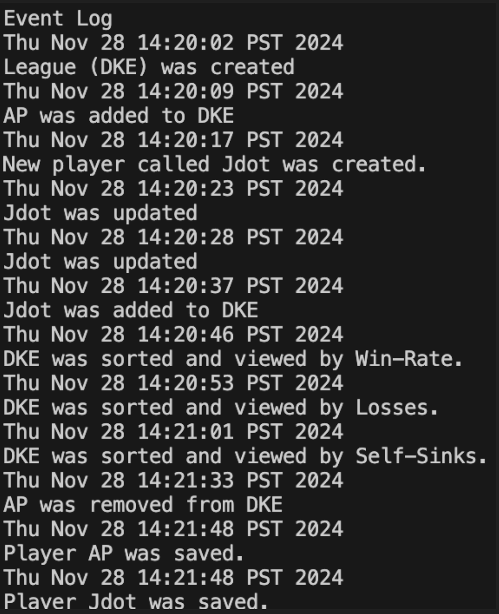

# My Personal Project 
My personal project is an application that revolves around the game of **'beer' dye**, a game that I have grown to love through being a part of a fraternity on campus. My friends I have often spent hours on end playing our own version of the game. The main purpose of the application is to track people's dye statistics which include:
- amount of games won, 
- amount lost, 
- win rate, 
- self-sink rate, etc. 

The application will also graph these statistics, allowing visual comnparison between people. In addition this, The application is to allow the end users to join leagues created within the application. Each league will have its own standings table and require a key to join. By default the standings will be determinded by win rate percentage. This aligns with the key targeted user group for the application of **groups of friends** (primarily those in their late teens or early twenties) who enjoy the game and, just like myself, get competitive about it. 

## User Stories
- As a user, I want to be able to create/add a new players.
- As a user, I want to be able to add players to different leagues.
- As a user, I want to be able to create new leagues. 
- As a user, I want to be able to view mine and others dye statistics such as my win rate, self-sink rate, etc.
- As a user, I want to be able to compare my statistics with the other people in my leagues with visual aid, such as graphs.
- As a user, I want to be able to see league standings for the leagues that have been created.
- As a user, I want to be able to choose to save the updated information that I have inputted, when closing the application.
- As a user, I want to be able to view a fully updated version of the application, with all inputted data from previous usages. 

# Instructions for End User
- You can add an X to a Y (adding a player to a league) by:
    - Selecting the "Add Player to League" button (left of the window).
    - Entering the name of the player that you would like to add in the pop-up window.
    - Entering the name of the league you would like to add the player to in the next pop-up window.
    - Entering the key of the league and confirming. 
- You can generate the first required action related to the user story "adding multiple Xs to a Y" (sorting the league by win-rate, losses or self-sinks) by:
    - Selecting the "View League Table" Button in the menu panel.
    - Entering the name of the league you would like to view.
    - entering w,l, or s for sorting in descending order by win-rate, losses, or self-sinks.
    - Once you confirm, league standings with the relevant sorting will be displayed.
- You can generate the second required action related to the user story "adding multiple Xs to a Y" (removing players from a certain league) by:
    - Selecting the "Remove Player from League" button (left of the window).
    - Entering the name of the player that you would like to remove in the pop-up window.
    - Entering the name of the league you would like to remove the player from in the next pop-up window.
    - Entering the key of the league and confirming. 
    - To remove multiple, repeat the process.
- You can locate my visual component by pressing the "View League Graph" and inputting the league you would like to view. Doing this will create a pop-up window which will present a bar chart where each bar is associated to a player in that league. The height of the bar represents the each player's win-rate. 
- You can save the state of my application by selecting the "Save Changes" button on the left side of the main window.
- You can reload the state of my application by selecting the "Load Data" button on the left side of the main window.

# Phase 4: Task 2

# Phase 4: Task 3

In conclusion, I believe my program has a relativeky straight-forward design. However, there are a few things I would change if I could spend more time on this project.

Firstly, I would re-factor the MainWindow class. At the moment, it is not cohesive and is therefore responsible for too many different things: managing the GUI, interacting with Player and League, and performing operations like loading and saving data. I would approach this re-fatcoring in a similar way that I approached the implementation of the bar chart pop-up (having a class for the JFrame and others for all teh respective panels). This is important because cohesion makes returning to the code much easier as it makes it all easier to understand. 

Secondly, the many-to-many relationship between Player and League creates bidirectional dependencies, making it complex to manage. One solution is to introduce a PlayerLeague class to encapsulate the relationship, allowing each class to focus on its own responsibilities. Alternatively, I believe that I could implement the observer pattern by inserting Observer and Observable classes. If I were to do this, I would make the League class the subject that notifies players when the league's state changes.